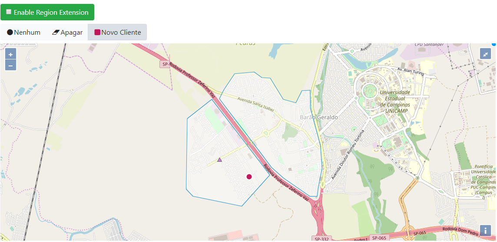

# Movile Next 3a Edition
by Marcos Oto Picarelli Prado

## Introduction

Create connection points for deliveries, opening possibilities for deliveries in regions that the customer does not have access to the establishment by standard rule (distance) of the application (eg: App iFood - Client Region A, Establishment Region B; Create a point A-B that enable the extension of ClientA-EstablishmentB);

The idea may expand:
 - Product type allowed in container
 - Product size allowed in container
 - Number of regions extension
 - Etc

### Standard rule ( Nowadays )


### Extension rule ( NOW WE CAN :) )


## Requirements
 - JDK 8 >=
 - Maven 3.3.1 >=

## Build

```console
cd ~
git clone https://github.com/opicarelli/MovileNext3_Backend_MarcosPrado.git
cd MovileNext3_Backend_MarcosPrado
mvn clean install
```

## Deploy

This is a sample of Java EE 7 project designed to easily deploy in Jboss Wildfly.

### Download Wildfly 11.0.0-Final
```console
cd ~
wget https://download.jboss.org/wildfly/11.0.0.Final/wildfly-11.0.0.Final.zip
#OR IF YOU DO NOT HAVE WGET TRY CURL
#curl https://download.jboss.org/wildfly/11.0.0.Final/wildfly-11.0.0.Final.zip --output wildfly-11.0.0.Final.zip
unzip wildfly-11.0.0.Final.zip
cd wildfly-11.0.0.Final
```

### Start Jboss Wildfly
```console
cd ~/wildfly-11.0.0.Final
./bin/standalone.sh
```

### Config Jboss Wildfly

Define datasource by configuration in parent/pom.xml wildfly-maven-plugin
```console
cd ~/MovileNext3_Backend_MarcosPrado
mvn wildfly:add-resource 
```

### Deploy ear in Jboss Wildfly
```console
cd ~/MovileNext3_Backend_MarcosPrado
mvn wildfly:deploy 
```

### Undeploy ear in Jboss Wildfly
```console
cd ~/MovileNext3_Backend_MarcosPrado
mvn wildfly:undeploy 
```

## Simulate the API

http://localhost:8080/portal

## REST API

Find all regions
```console
http://localhost:8080/portal/rest/regions
```

Enable or Disable the FEATURE Region Extension
```console
http://localhost:8080/portal/rest/flagregionextension
Body {enable:true}
```

Find all establishments by a simulated client (coordinate X and Y)
```console
http://localhost:8080/portal/rest/establishments?pointWkt={pointWkt}
```
